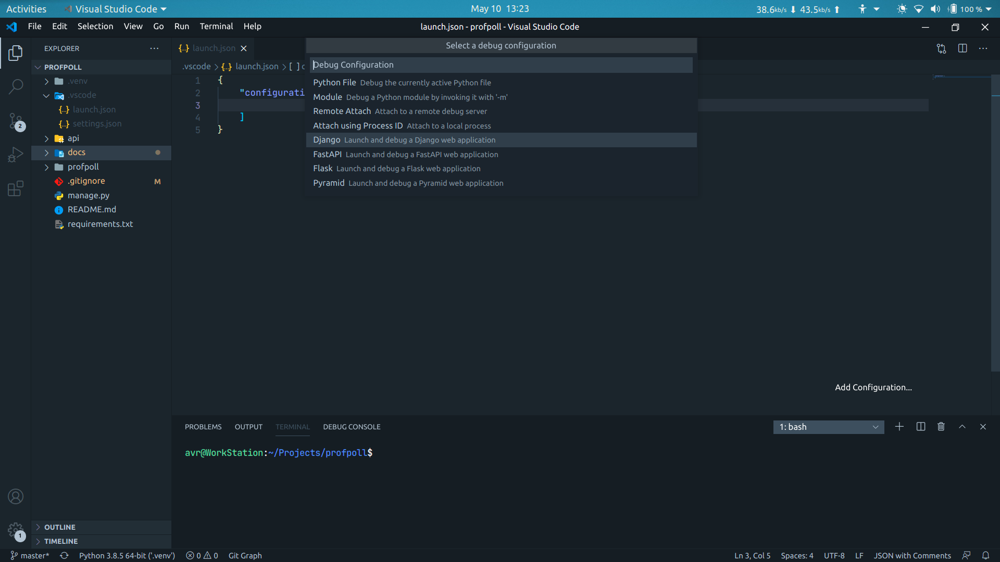
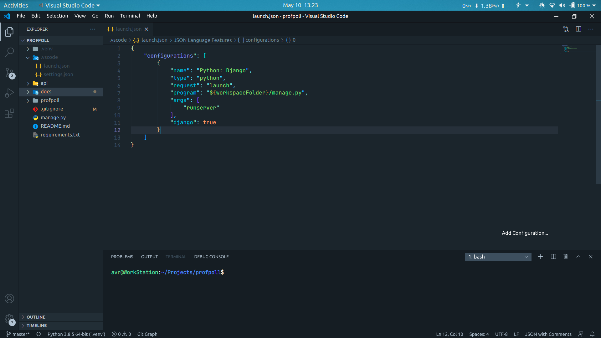

.. _vscode-setup:

SetUp VS-Code
=============

Prerequisites: 
--------------
* Set up the project locally :ref:`here<get-started>`
   
Install The Python extension
----------------------------
Get the python extension up and running in your vscode. Either Install
it from the extension browser or write ``ext install python`` in the vscode
command palette.

In the ``launch.json`` under ``.vscode`` directory add a new configuration like below.

The preset ``launch.json`` configuration will look something like:

This configuration is sufficient by default. However if you want to serve
the project over a LAN then you need to add a few arguments in the 
``launch.json`` like below.

.. code-block::

    "args":[
        "runserver",
        "$IP:PORT",
    ]

where ``$IP:PORT`` must be replaced by the IP address and the port number of the 
network where you want to serve the project.

